# spout_social

A decentralized social networking system for building tight-knit communities.

## Model

```mermaid
erDiagram
    moderator ||--|| user : "is"
    contributor ||--|| user : "is"
    reader ||--|| user : "is"
    coordinator ||--|| user: "is"
    coordinator |o..|{ action_log : "consumes"

    user_document{
        text handle
        blob picture
        text bio
        text name
        text location
    }
    user ||--|{ user_document : "maintains"


    relay ||--o{ cell : "lists"
    coordinator }|--|{ cell_document : "maintains"

    user_action {
        string action_type

    }

    user ||..o{ action_log : "acts via"
    user_document ||--o{ action_log : "contains"
    action_log ||--o{ user_action : "contains"
    cell ||--|| cell_document : "is"

    cell_document{
        text name
        text description
        bool sensitive "18+"
    }

    post{
        text user_id
        text user_handle
        number timestamp
        text post_id
        text title
        text body
    }

    comment{
        text user_id
        text user_handle
        number timestamp
        text context_id
        text body
    }

    reaction{
        text user_id
        text user_handle
        number timestamp
        text context_id
        text emote
    }

    cell_document ||--|{ post : "contains"
    post ||--|{ comment : "contains"
    comment ||--|{ reaction : "contains"
    post ||--|{ reaction : "contains"
    user |o..|{ cell_document : "consumes"
```

## Terms

Cell
: A distinct community

Coordinator
: The primary node that coordinates cell activity. The source-of-truth for this cell.

Co-coordinator
: Any node, aside from the original coordinator, that has an author ticket to the cell's primary document.

Document
: An Iroh term for data stores that are shared across devices.

Moderator
: A node authorized to take moderation actions within a cell. Moderators are assigned by the cell coordinator and all mod actions must be processed by a coordinating node before taking effect.

Post
: A top-level submission to a cell's feed. Posts can have a `title` and a `body`.

Comment
: A text-based response to a `post` or `comment`.

Reaction
: An emoji-based response to a `comment` or `post`.

